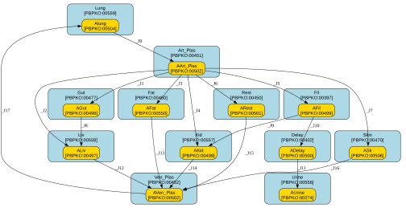

# PBK_PFAS

## Notes

<notes>
  <body xmlns="http://www.w3.org/1999/xhtml">
    
Generic PFAS PBK model implementation in Antimony based on the PFOA PBK   model of Westerhout et al. (2024) without lifetime dynamics/equations. 

    
 Changes with respect to original model: 

    
 1) No lifetime dynamics/equations. 

    
 2) General model structure for PFAS. 

    
 3) Changed the calculation of CvenFree, Cven, CartFree and Cart to correctly present the free fraction. 

    
 4) Changed the &apos;Free&apos; in the lung differential equation to &apos;FreeLun&apos;. 

  </body>
</notes>

## Overview

| key                          | value                          |
|:-----------------------------|:-------------------------------|
| Modelled species/orgamism(s) | *not specified*                |
| Model chemical(s)            | *not specified*                |
| Input route(s)               | 3 (inhalation, dermal, oral)   |
| Time resolution              | d                              |
| Amounts unit                 | ug                             |
| Volume unit                  | L                              |
| Number of compartments       | 12                             |
| Number of species            | 12                             |
| Number of parameters         | 54 (35 external / 19 internal) |

## Creators

| first-name   | last-name     | affiliation   | email   |
|:-------------|:--------------|:--------------|:--------|
| Jordi        | Minnema       | RIVM          |         |
| Joost        | Westerhout    | RIVM          |         |
| Johannes     | Kruisselbrink | WUR           |         |

## Diagram

## Compartments

| id       | name                         | unit   | model qualifier                            |
|:---------|:-----------------------------|:-------|:-------------------------------------------|
| Lung     | lung                         | L      | http://purl.obolibrary.org/obo/PBPKO_00559 |
| Skin     | skin                         | L      | http://purl.obolibrary.org/obo/PBPKO_00470 |
| Ven_Plas | venous blood                 | L      | http://purl.obolibrary.org/obo/PBPKO_00452 |
| Art_Plas | arterial blood               | L      | http://purl.obolibrary.org/obo/PBPKO_00451 |
| Gut      | gut                          | L      | http://purl.obolibrary.org/obo/PBPKO_00477 |
| Liv      | liver                        | L      | http://purl.obolibrary.org/obo/PBPKO_00558 |
| Fat      | adipose tissue               | L      | http://purl.obolibrary.org/obo/PBPKO_00460 |
| Kid      | kidney                       | L      | http://purl.obolibrary.org/obo/PBPKO_00557 |
| Fil      | filtrate                     | L      | http://purl.obolibrary.org/obo/PBPKO_00397 |
| Rest     | rest-of-body                 | L      | http://purl.obolibrary.org/obo/PBPKO_00450 |
| Delay    | storage compartment of urine | L      | http://purl.obolibrary.org/obo/PBPKO_00402 |
| Urine    | urine                        | L      | http://purl.obolibrary.org/obo/PBPKO_00556 |

## Species

| id        | name                              | unit   | model qualifier                            |
|:----------|:----------------------------------|:-------|:-------------------------------------------|
| Alung     | quantity in lung                  | ug     | http://purl.obolibrary.org/obo/PBPKO_00504 |
| ASk       | quantity in skin                  | ug     | http://purl.obolibrary.org/obo/PBPKO_00506 |
| AVen_Plas | quantity in venous blood plasma   | ug     | http://purl.obolibrary.org/obo/PBPKO_00502 |
| AArt_Plas | quantity in arterial blood plasma | ug     | http://purl.obolibrary.org/obo/PBPKO_00502 |
| AGut      | quantity in gut                   | ug     | http://purl.obolibrary.org/obo/PBPKO_00496 |
| ALiv      | quantity in liver                 | ug     | http://purl.obolibrary.org/obo/PBPKO_00497 |
| AFat      | quantity in fat                   | ug     | http://purl.obolibrary.org/obo/PBPKO_00550 |
| AKid      | quantity in kidney                | ug     | http://purl.obolibrary.org/obo/PBPKO_00498 |
| AFil      | quantity in filtrate              | ug     | http://purl.obolibrary.org/obo/PBPKO_00499 |
| ADelay    | quantity in delay                 | ug     | http://purl.obolibrary.org/obo/PBPKO_00500 |
| AUrine    | quantity in urine                 | ug     | http://purl.obolibrary.org/obo/PBPKO_00274 |
| ARest     | quantity in rest-of-body          | ug     | http://purl.obolibrary.org/obo/PBPKO_00501 |

## Transfer equations

| id   | from      | to        | equation                              |
|:-----|:----------|:----------|:--------------------------------------|
| _J0  | Alung     | AArt_Plas | QCP * FreeLun * (Alung / Lung)        |
| _J1  | AArt_Plas | AGut      | QG * Free * (AArt_Plas / Art_Plas)    |
| _J2  | AArt_Plas | ALiv      | QL * Free * (AArt_Plas / Art_Plas)    |
| _J3  | AArt_Plas | AFat      | QF * Free * (AArt_Plas / Art_Plas)    |
| _J4  | AArt_Plas | AKid      | QK * Free * (AArt_Plas / Art_Plas)    |
| _J5  | AArt_Plas | AFil      | Qfil * Free * (AArt_Plas / Art_Plas)  |
| _J6  | AArt_Plas | ARest     | QR * Free * (AArt_Plas / Art_Plas)    |
| _J7  | AArt_Plas | ASk       | QSk * Free * (AArt_Plas / Art_Plas)   |
| _J8  | AGut      | ALiv      | QG * FreeG * (AGut / Gut)             |
| _J9  | AFil      | AKid      | Tm * (AFil / Fil) / (Kt + AFil / Fil) |
| _J10 | AFil      | ADelay    | Qfil * (AFil / Fil)                   |
| _J11 | ADelay    | AUrine    | kurine * ADelay                       |
| _J12 | ALiv      | AVen_Plas | (QL + QG) * FreeL * (ALiv / Liv)      |
| _J13 | AFat      | AVen_Plas | QF * FreeF * (AFat / Fat)             |
| _J14 | AKid      | AVen_Plas | QK * FreeK * (AKid / Kid)             |
| _J15 | ARest     | AVen_Plas | QR * FreeR * (ARest / Rest)           |
| _J16 | ASk       | AVen_Plas | QSk * FreeSk * (ASk / Skin)           |
| _J17 | AVen_Plas | Alung     | QCP * Free * (AVen_Plas / Ven_Plas)   |

## ODEs

d[Alung]/dt = - QCP * FreeLun * (Alung / Lung)
              + QCP * Free * (AVen_Plas / Ven_Plas)

d[ASk]/dt = QSk * Free * (AArt_Plas / Art_Plas)
            - QSk * FreeSk * (ASk / Skin)

d[AVen_Plas]/dt = (QL + QG) * FreeL * (ALiv / Liv)
                  + QF * FreeF * (AFat / Fat)
                  + QK * FreeK * (AKid / Kid)
                  + QR * FreeR * (ARest / Rest)
                  + QSk * FreeSk * (ASk / Skin)
                  - QCP * Free * (AVen_Plas / Ven_Plas)

d[AArt_Plas]/dt = QCP * FreeLun * (Alung / Lung)
                  - QG * Free * (AArt_Plas / Art_Plas)
                  - QL * Free * (AArt_Plas / Art_Plas)
                  - QF * Free * (AArt_Plas / Art_Plas)
                  - QK * Free * (AArt_Plas / Art_Plas)
                  - Qfil * Free * (AArt_Plas / Art_Plas)
                  - QR * Free * (AArt_Plas / Art_Plas)
                  - QSk * Free * (AArt_Plas / Art_Plas)

d[AGut]/dt = QG * Free * (AArt_Plas / Art_Plas)
             - QG * FreeG * (AGut / Gut)

d[ALiv]/dt = QL * Free * (AArt_Plas / Art_Plas)
             + QG * FreeG * (AGut / Gut)
             - (QL + QG) * FreeL * (ALiv / Liv)

d[AFat]/dt = QF * Free * (AArt_Plas / Art_Plas)
             - QF * FreeF * (AFat / Fat)

d[AKid]/dt = QK * Free * (AArt_Plas / Art_Plas)
             + Tm * (AFil / Fil) / (Kt + AFil / Fil)
             - QK * FreeK * (AKid / Kid)

d[AFil]/dt = Qfil * Free * (AArt_Plas / Art_Plas)
             - Tm * (AFil / Fil) / (Kt + AFil / Fil)
             - Qfil * (AFil / Fil)

d[ADelay]/dt = Qfil * (AFil / Fil)
               - kurine * ADelay

d[AUrine]/dt = kurine * ADelay

d[ARest]/dt = QR * Free * (AArt_Plas / Art_Plas)
              - QR * FreeR * (ARest / Rest)

## Assignment rules

Lung = VlunC * BW

Skin = FSkinExposed * BSA * SkinThickness / 1000

Ven_Plas = VvenC * VPlasC * BW

Art_Plas = VartC * VPlasC * BW

Gut = VGC * BW

Liv = VLC * BW

Fat = VFC * BW

Kid = VKC * BW

Fil = VfilC * BW

Rest = (FBW - VLC - VFC - VKC - VfilC - VGC - VPlasC - VlunC) * BW - Skin

BSA = 9.1 * pow(BW * 1000, 0.666)

kurine = kurinec * pow(BW, -0.25)

Tm = Tmc * pow(BW, 0.75)

FreeL = Free / PL

FreeF = Free / PF

FreeK = Free / PK

FreeSk = Free / PSk

FreeR = Free / PR

FreeG = Free / PG

FreeLun = Free / PLun

QC = QCC * pow(BW, 0.75)

QCP = QC * (1 - Htc)

QL = QLC * QCP

QF = QFC * QCP

QK = QKC * QCP

Qfil = QfilC * QK

QG = QGC * QCP

QSk = QSkC * QCP

QR = QCP - QL - QF - QK - QG - QSk

## Parameters

| id            | name                                                                  | unit          | model qualifier                            |
|:--------------|:----------------------------------------------------------------------|:--------------|:-------------------------------------------|
| BW            | body weight                                                           | kg            | http://purl.obolibrary.org/obo/PBPKO_00008 |
| QCC           | cardiac blood output                                                  | L/d/kg^0.75   | http://purl.obolibrary.org/obo/PBPKO_00013 |
| QFC           | fraction cardiac output going to fat                                  | dimensionless | http://purl.obolibrary.org/obo/PBPKO_00033 |
| QLC           | fraction cardiac output going to liver                                | dimensionless | http://purl.obolibrary.org/obo/PBPKO_00025 |
| QKC           | fraction cardiac output going to kidney                               | dimensionless | http://purl.obolibrary.org/obo/PBPKO_00027 |
| QfilC         | fraction of kidney plasma flow to filtrate                            | dimensionless | http://purl.obolibrary.org/obo/PBPKO_00511 |
| QSkC          | fraction cardiac output going to skin                                 | dimensionless | http://purl.obolibrary.org/obo/PBPKO_00037 |
| QGC           | fraction of cardiac output going to gut and the liver via portal vein | dimensionless | http://purl.obolibrary.org/obo/PBPKO_00531 |
| FBW           | Fraction of the BW covered by the sum of the compartments             | L/kg          | *not specified*                            |
| VLC           | fraction liver volume                                                 | L/kg          | http://purl.obolibrary.org/obo/PBPKO_00078 |
| VFC           | fraction fat volume                                                   | L/kg          | http://purl.obolibrary.org/obo/PBPKO_00086 |
| VKC           | fraction kidney volume                                                | L/kg          | http://purl.obolibrary.org/obo/PBPKO_00080 |
| VfilC         | fraction filtrate compartment volume                                  | L/kg          | http://purl.obolibrary.org/obo/PBPKO_00508 |
| VGC           | fraction gut volume                                                   | L/kg          | http://purl.obolibrary.org/obo/PBPKO_00509 |
| VlunC         | fraction lung volume                                                  | L/kg          | http://purl.obolibrary.org/obo/PBPKO_00098 |
| VPlasC        | fraction plasma volume                                                | L/kg          | http://purl.obolibrary.org/obo/PBPKO_00104 |
| VartC         | fraction arterial plasma volume                                       | dimensionless | *not specified*                            |
| VvenC         | fraction venous plasma volume                                         | dimensionless | *not specified*                            |
| Htc           | hematocrit                                                            | dimensionless | *not specified*                            |
| BSA           | total area of the skin                                                | cm^2          | http://purl.obolibrary.org/obo/PBPKO_00010 |
| SkinThickness | skin thickness                                                        | cm            | *not specified*                            |
| FSkinExposed  | fraction of skin exposed                                              | dimensionless | http://purl.obolibrary.org/obo/PBPKO_00061 |
| MW            | molar weight                                                          | g/mol         | http://purl.obolibrary.org/obo/PBPKO_00127 |
| logP          | logP                                                                  | dimensionless | http://purl.obolibrary.org/obo/PBPKO_00131 |
| VP            | vapor pressure                                                        | kg/m/s^2      | *not specified*                            |
| Tmc           | maximum resorption rate                                               | ug/d/kg^0.75  | http://purl.obolibrary.org/obo/PBPKO_00535 |
| Kt            | resorption affinity                                                   | ug/L          | http://purl.obolibrary.org/obo/PBPKO_00536 |
| kurinec       | urinary elimination rate constant                                     | /d.kg^0.25    | http://purl.obolibrary.org/obo/PBPKO_00520 |
| Free          | free fraction in plasma                                               | dimensionless | http://purl.obolibrary.org/obo/PBPKO_00591 |
| PL            | partition coefficient liver/plasma                                    | dimensionless | http://purl.obolibrary.org/obo/PBPKO_00170 |
| PF            | partition coefficient fat/plasma                                      | dimensionless | http://purl.obolibrary.org/obo/PBPKO_00174 |
| PK            | partition coefficient kidney/plasma                                   | dimensionless | http://purl.obolibrary.org/obo/PBPKO_00171 |
| PSk           | partition coefficient skin/plasma                                     | dimensionless | http://purl.obolibrary.org/obo/PBPKO_00176 |
| PR            | partition coefficient rest-of-body/plasma                             | dimensionless | http://purl.obolibrary.org/obo/PBPKO_00518 |
| PG            | partition coefficient gut/plasma                                      | dimensionless | http://purl.obolibrary.org/obo/PBPKO_00166 |
| PLun          | partition coefficient lung/plasma                                     | dimensionless | http://purl.obolibrary.org/obo/PBPKO_00179 |
| kurine        | urinary elimination rate constant                                     | /d            | http://purl.obolibrary.org/obo/PBPKO_00520 |
| Tm            | transporter maximum                                                   | ug/d          | http://purl.obolibrary.org/obo/PBPKO_00535 |
| FreeL         | free fraction of chemical in liver                                    | dimensionless | http://purl.obolibrary.org/obo/PBPKO_00154 |
| FreeF         | free fraction of chemical in fat                                      | dimensionless | http://purl.obolibrary.org/obo/PBPKO_00158 |
| FreeK         | free fraction of chemical in kidney                                   | dimensionless | http://purl.obolibrary.org/obo/PBPKO_00155 |
| FreeSk        | free fraction of chemical in skin                                     | dimensionless | http://purl.obolibrary.org/obo/PBPKO_00160 |
| FreeR         | free fraction of chemical in rest of body                             | dimensionless | *not specified*                            |
| FreeG         | free fraction of chemical in gut                                      | dimensionless | http://purl.obolibrary.org/obo/PBPKO_00150 |
| FreeLun       | free fraction of chemical in lung                                     | dimensionless | http://purl.obolibrary.org/obo/PBPKO_00163 |
| QC            | cardiac output adjusted for body weight                               | L/d           | http://purl.obolibrary.org/obo/PBPKO_00013 |
| QCP           | cardiac output adjusted for plasma flow                               | L/d           | http://purl.obolibrary.org/obo/PBPKO_00528 |
| QL            | scaled plasma flow to liver                                           | L/d           | http://purl.obolibrary.org/obo/PBPKO_00024 |
| QF            | scaled plasma flow to fat                                             | L/d           | http://purl.obolibrary.org/obo/PBPKO_00032 |
| QK            | scaled plasma flow to kidney                                          | L/d           | http://purl.obolibrary.org/obo/PBPKO_00026 |
| Qfil          | plasma flow to filtrate compartment                                   | L/d           | http://purl.obolibrary.org/obo/PBPKO_00529 |
| QG            | scaled plasma flow to gut                                             | L/d           | http://purl.obolibrary.org/obo/PBPKO_00531 |
| QSk           | scaled plasma flow to the skin                                        | L/d           | http://purl.obolibrary.org/obo/PBPKO_00036 |
| QR            | plasma flow to the rest of the body                                   | L/d           | http://purl.obolibrary.org/obo/PBPKO_00050 |

